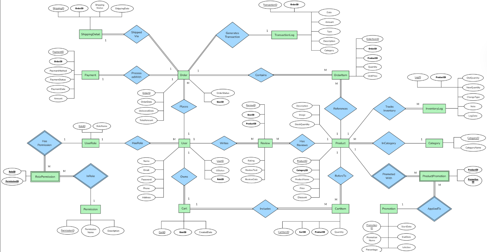

# 🛒 E-Commerce Web Application (Online Shopping System)


> **"A complete implementation of an Online Store from Database Design to Web Deployment."**
> Utilizing advanced database concepts (Normalization, Triggers, Indexes) to build a robust e-commerce platform.

---

## 📄 Full Project Documentation
This repository contains the source code and the **comprehensive final report**, detailing the system analysis, database design (ERD), normalization process, and user manual.

https://drive.google.com/file/d/13wUpY-kz3gcmDSXsI6lPj2ssQ4d3xjON/view?usp=sharing
*(Note: Please click the link above to view the detailed documentation)*

---

## 🔍 Project Overview

### 🎯 Objective
To design and develop a web-based application for managing an online store. [cite_start]The project aims to demonstrate proficiency in **Database Systems** by handling complex data relationships, ensuring data integrity through normalization (up to 3NF), and implementing real-world transaction flows [cite: 82-84].

### 🛠️ Key Features
* **User Management:** Secure Authentication & Authorization (Admin vs Customer).
* **Product Catalog:** Dynamic product listing with detailed views and stock management.
* **Shopping Cart & Checkout:** Seamless order processing flow.
* **Database Triggers:** Automated inventory updates upon successful payment.
* **Reporting:** Sales reports and customer insights for Admins.

---

## 🗄️ System Architecture & Design

### 1. Entity-Relationship Diagram (ERD)
The database models key e-commerce entities: `Customers`, `Products`, `Orders`, `Payments`, and `Reviews`.



### 2. Relational Schema
The database schema ensures referential integrity and optimized query performance.
erDiagram
    UserRole ||--o{ User : "assigned to"
    UserRole ||--o{ RolePermission : "has"
    Permission ||--o{ RolePermission : "contains"
    
    User ||--o{ Cart : "owns"
    User ||--o{ Review : "writes"
    User ||--o{ Order : "places"
    
    Category ||--o{ Product : "categorizes"
    Product ||--o{ ProductPromotion : "has"
    Promotion ||--o{ ProductPromotion : "included in"
    
    Product ||--o{ CartItem : "added to"
    Product ||--o{ Review : "reviewed in"
    Product ||--o{ OrderItem : "ordered in"
    Product ||--o{ InventoryLog : "logged in"

    Cart ||--o{ CartItem : "contains"
    
    Order ||--o{ OrderItem : "contains"
    Order ||--|| Payment : "paid via"
    Order ||--|| ShippingDetail : "shipped via"
    Order ||--o{ TransactionLog : "generates"

    User {
        int UserID PK
        string Name
        string Email
        string RoleID FK
    }
    Product {
        int ProductID PK
        string ProductName
        decimal Price
        int StockQuantity
        int CategoryID FK
    }
    Order {
        int OrderID PK
        int UserID FK
        datetime OrderDate
        decimal TotalAmount
    }
### 💻 Tech Stack
* [cite_start]**Frontend:** HTML5, CSS3, Bootstrap 5.3.3 (Responsive Design)[cite: 114].
* **Backend:** PHP (Native) for server-side logic and database connectivity.
* **Database:** MySQL / MariaDB.
* **Server:** Apache (via XAMPP/MAMP).

```php
// Sample Code: Database Connection & Product Query
include("connection.php");
$productID = $_GET["ProductID"];
$sql = "SELECT * FROM product WHERE ProductID = '$productID'";
// ... (Logic to display product details)
